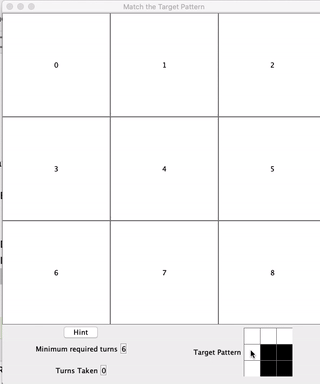
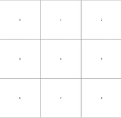
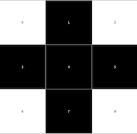
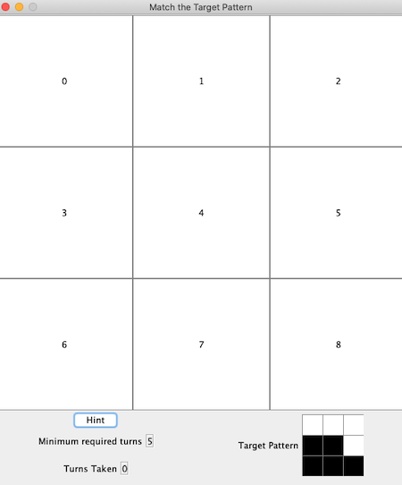
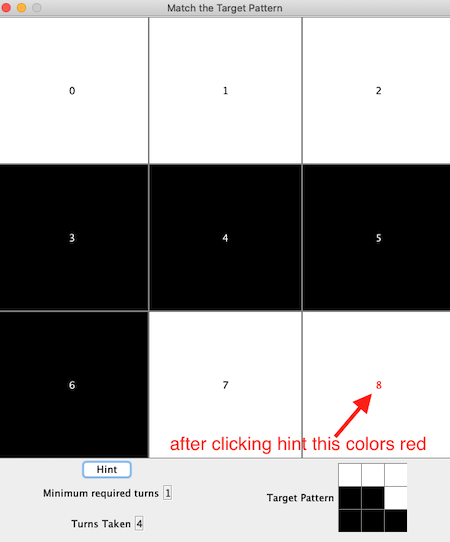

The game is a 3x3 grid of squares that are either black or white. Clicking on any square will change the color of that square and its 4 neighbours (north, south, east and west) to their opposite color, i.e., black becomes white and vice versa.

Example: Clicking the middle square on the first board below will yield the second board:

  clicking square 4 (middle square) yields 

Games start with the 3x3 grid comprised solely of white squares and players are shown a randomly generated target board configuration of black and white squares. The goal for the player is to click squares and eventually end up with the target configuration (coloring).

See below the initial game screen:



The code implements the following ToggleGameInteraction interface in the `ToggleGameEngine.java` file:

```java
/**
 * The required functionality for the front-end to operate correctly in the
 * Toggle Game.
 *
 * No alterations are required in this file.
 *
 * You should implement this interface in your ToggleGameEngine Solution
 */
public interface ToggleGameInteraction {
    /*
     *  Game board buttons are numbered as follows:
     *    0 1 2
     *    3 4 5
     *    6 7 8
     */


    /**
     * Initialize and return the game board for a ToggleGame
     * @return the String "111111111" to start a game with all white squares
     */
    public String initializeGame();

    /**
     * Update the game board for the given button that was clicked.
     * Squares marked as 0 are black and 1 is white
     *
     * @param button the game board square button that was clicked (between 0 and 8)
     *
     * @return the updated game board as a String giving the button colors in order
     *         with "0" for black and "1" for white.
     *
     * @throws IllegalArgumentException when button is outside 0:8
     */
    public String buttonClicked(String currentBoard, int button);

    /**
     * Return a sequence of moves that leads in the minimum number of moves
     * from the current board state to the target state
     *
     * @param current the current board state given as a String of 1's (white square)
     *                and 0's (black square)
     * @param target the target board state given as a String of 1's (white square)
     *               and 0's (black square)
     * @return the sequence of moves to advance the board from current to target.
     *         Each move is the number associated with a button on the board
     *
     */
    public int[] movesToSolve(String current, String target);

    /**
     * Return the minimum required number of required moves (button clicks)
     * to advance the current board to the target board.
     *
     * @param current the current board state given as a String of 1's (white square)
     *                and 0's (black square)
     * @param target the target board state given as a String of 1's (white square)
     *               and 0's (black square)
     * @return the minimum number of moves to advance the current board
     * to the target
     */
    public int minNumberOfMoves(String current, String target);

}
```

The implemented interface does the following things:

- updates the game board when a button (square) on the game board is clicked
- computes the minimum number of moves to go from one state to another (noted how many moves to go from the current game board state to the target state)
- computes a minimum sequence of button clicks to advance from one state to another given state.

The game board frontend is designed as a series of 9 clickable buttons numbered as follows:

```ascii
0 1 2
3 4 5
6 7 8
```

There is also a hint button which the game player can click and it will call out to the `movesToSolve` method in the backend to get the minimum sequence of moves leading to the solution. The first of those moves will show up in the game board with the text colored RED:



Each time the user clicks one of the squares in the game, each of the `buttonClicked` and `minNumberOfMoves` methods are called in your backend code and the results of those calls are used to update the game screen.

## Building the Game

The game can be launched by building and running Driver.main in the ToggleGame.Driver.java file.

The game will build and run without any modifications, however it will not perform correctly until you have completed the required portions in `ToggleGameEngine.java`. It will just generate random boards and answers.

There are unit-tests in the test directory and can be run through IntelliJ.


The interface provided assumes that the game board is passed back and forth as Strings. In the String, "1" represents white, and "0" represents black. The order of the characters in the String is the same as the above order of the squares/buttons, i.e., the character at position 0 in the String is the 0 square/button, position 1 is the 1 square/button, etc. Thus the String "111111111" represents a game board with all 9 squares colored white. While the String "111001000" represents the target pattern in the above example image.

There are $2^9=512$ possible board configurations (states). An exhaustive search from some board configuration leading to all possible other states will execute quick enough for the purposes of our game (provided cycles are avoided). 


- Code design - separation of algorithms from specific implementations, proper use of classes and methods

- Specific tests: Each of the above reference a specific set of tests in the ToggleGameEngineTest.java file. The FirstDeliverableTests are somewhat simple identity tests, BoardStatesTests are tests related to handling button clicks and updating the board, MinimumRequiredMoves tests involves properly determining the minimum number of required moves remaining. PathToTargetTests involves testing to determine if the path (button clicks required) to the target is working.

Total grade: X / 10
